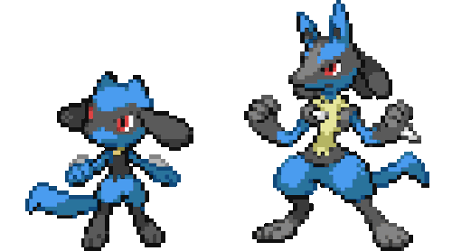

<!-- Banner animado con typing SVG -->

  

<h1 align="center">
  <b>Sebastián Bravo</b>
</h1>

  🇨🇱 Estudiante de 4to año de <strong>Ingeniería en Informática</strong> en INACAP, Temuco. 
  Apasionado por el desarrollo web, las buenas prácticas y contribuir al open source. 
  Actualmente enfocado en React, Django y arquitectura de software.

<!-- Lucario GIF animado con mensaje aura -->

  

  <em><!-- AURA:START -->⚡ Detectando aura en el código... — 22/04/2026<!-- AURA:END --></em>

<!-- Redes sociales -->

  
  
  

---

### 🛠️ Stack Tecnológico

**Lenguajes**

  
  
  
  
  
  

**Frontend**

  
  
  
  
  
  
  

**Backend**

  
  
  
  
  

**Base de Datos y DevOps**

  
  
  
  
  
  

---

### 📊 Estadísticas

  

  

---
